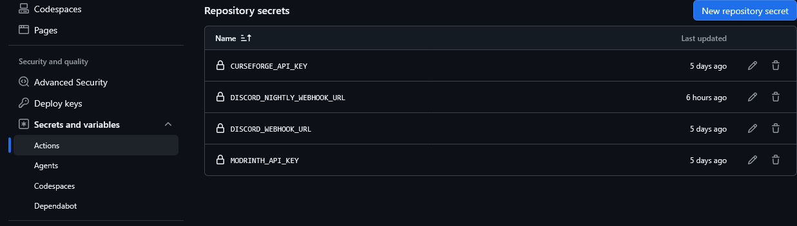
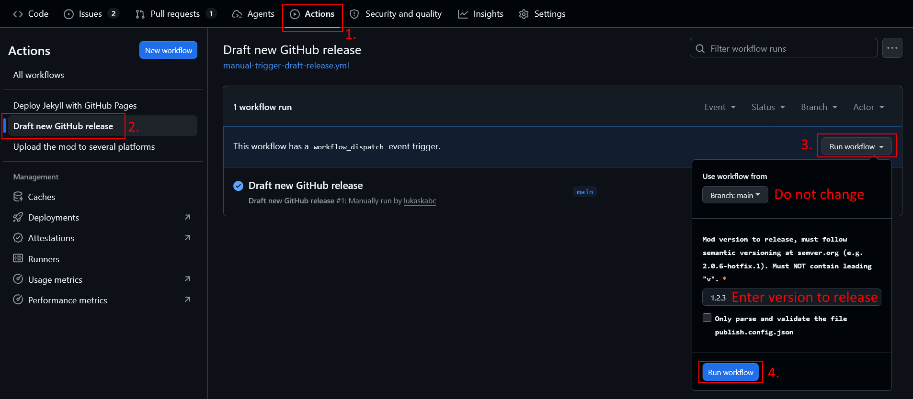

# GitHub Workflows

## Requirements
Following repository secrets needs to be maintained (and refreshed if API keys expire).

Repository > Settings > Secrets and variables > Actions

- `CURSEFORGE_API_KEY`
- `MODRINTH_API_KEY`
- `DISCORD_WEBHOOK_URL`

See the [reusable workflows documentation](https://github.com/lukaskabc/Minecraft-Mod-Publish-Workflows/blob/main/MAIN-RELEASE.md#3-setup-secrets) for details.

## Releasing new version

1. Trigger workflow to create a new GitHub Release Draft

- Go to [GitHub actions](https://github.com/Povstalec/StargateJourney/actions)
- In the left select `Draft new GitHub release`
- In the right select `Run workflow`
- Fill in the version to release and submit
- **The workflow will take some time since it needs to compile all the artifacts**
2. The workflow will automatically create Draft in [GitHub releases](https://github.com/Povstalec/StargateJourney/releases)
3. Edit the draft
- Update the release description with changelog (this changelog will be replicated to all platforms for all artifacts)
- Never change the associated tag that was automatically created
4. Wait until the workflow finishes and all artifacts are uploaded to the release draft
5. (Optional/Recommended) Test compiled artifacts
6. Publish the GitHub release draft
- New workflow will be automatically triggered
- The artifacts will be uploaded to Curseforge and Modrinth
- If any upload fails due to platform outage, the job for the specific artifact can be re-run from GitHub UI
